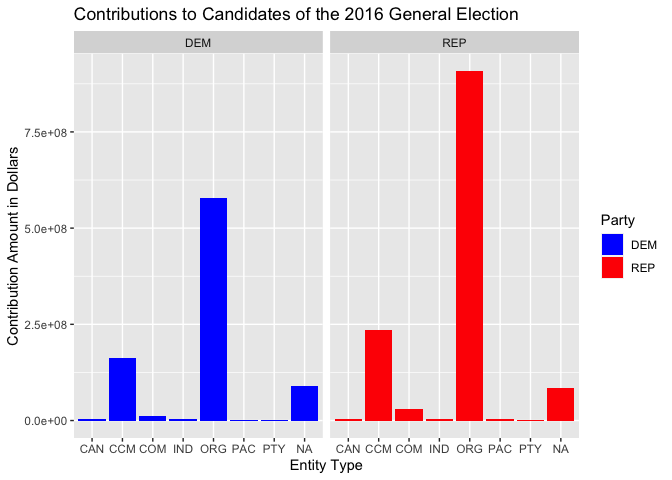

Contributions to the 2016 General Election by Entity Type
================

## Code

``` r
contributions <- read_all_contributions()

contributions2 <- contributions %>% 
  left_join(candidates, by = "cand_id") %>% 
  filter(cand_pty_affiliation == "DEM" | cand_pty_affiliation == "REP") %>% 
  select(entity_tp, cand_pty_affiliation, transaction_amt) %>% 
  group_by(cand_pty_affiliation, entity_tp) %>% 
  summarize(sum = sum(transaction_amt))
```

## Financial Contributions Data Vizualization

<!-- -->

## Summary of Vizualization

This graph shows the contributions to Democratic and Republican
candidates in the 2016 general election separated by the type of entity
which was contributing.

One observation from the graph is that the largest contributor to
candidates from both parties is organizations (ORG), followed by
contributions from candidate committees (CCM), and then finally by
contributions not listed as a certain entity type (N/A). The other
entity types’ contributed proportionately minuscule amounts of money to
the campaigns, making organizations and candidate committees the most
important and influential contributors.

Additionally, while Republicans and Democrats received very similar
contribution amounts from many of the entities, Republicans received
much more from organizations and candidate committees. Republicans had
approximately 250 million more dollars in contributions from
organizations and approximately 100 million more dollars in
contributions from candidate committees than Democrats.

In regards to the larger amount of contributions from candidate
committees, this could be for a variety of reasons including better
marketing or fundraising efforts. However, the 250 million dollar
difference between the contributions from organizations to Republicans
and Democrats is very significant. It is likely that organizations
donate more to Republicans because powerful organizations believe that
they would benefit better by having Republicans in power as they will be
more likely to pass and uphold legislation that would benefit big
businesses. For this reason, Republicans receiving more funds from
organizations makes sense because they more frequently support large
corporations due to their support for policies like lower taxes, less
regulation, and smaller government.
